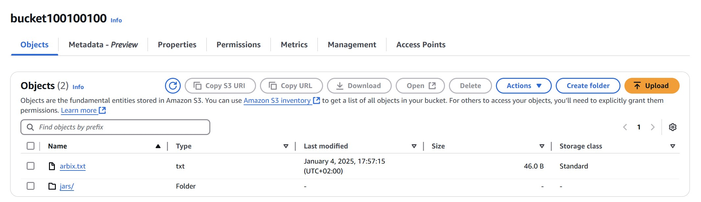
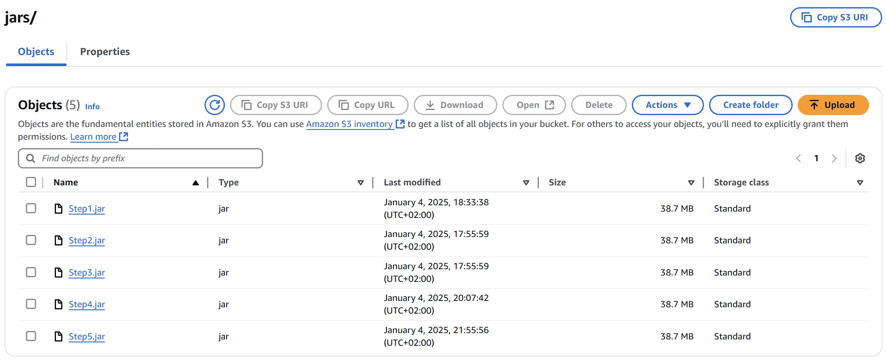

<!-- Markdown file -->
<!-- In VS code, use ctrl + shift + v to see preview -->
<!-- In IntelliJ, Click the "Preview" icon (top-right) or use Ctrl/Cmd + Shift + A and search for "Markdown Preview." -->

 

# README
## Backround
This project is part of BGU University's Distributed System Programming course, Assignment 2.  
The project is map-reduce algorithm.  
Implementation by Amazon Web Services (AWS) and Hadoop framework.  
[Instructions Assignment 2](resources/Assignment2.pdf)

## Overview
In this assignment you will generate a knowledge-base for Hebrew word-prediction system, based on
Google 3-Gram Hebrew dataset, using Amazon Elastic Map-Reduce (EMR).  
[Outputs Examples](resources/OutputsExamples)

## How to run
1. Configure AWS credentials in your machine.
2. Create `S3 bucket` with the name specified at `App` line 21.
3. Create a `jar` for each step (5 steps). When creating a `JAR` file, ensure that the `META-INF/MANIFEST.MF` file specifies the appropriate `main class`.
4. Using the file system change the name of the `jars` to: `Step1`, `Step2` ... (exact name)
5. At the `S3 bucket` create a `jar` folder.
6. Upload the `jars` to `<bucketName>/jars`.
7. For Demo: `arbix.txt` file is in the `<bucketName>`. This file used as an example input.
8. Run `App`.

 
Bucket Structure At Start:

Bucket Jars Structure At Start:

Note: make sure that the S3 bucket doest inculcated `output` or `log` folder pre-run.

## Logic Diagram
[Diagram PDF](resources/A2_Logic_Diagram.pdf)  
[draw.io Diagram](https://drive.google.com/file/d/1VjUymYuY0KmfWGZVFDFdpoWrRNe8jw-8/view?usp=sharing)  

